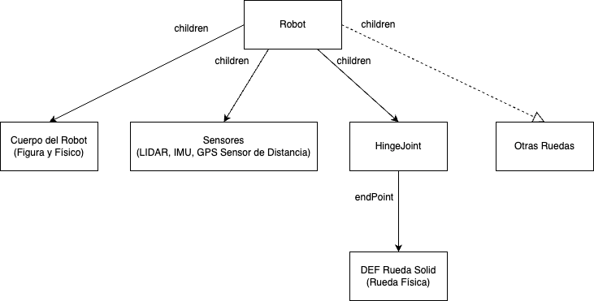
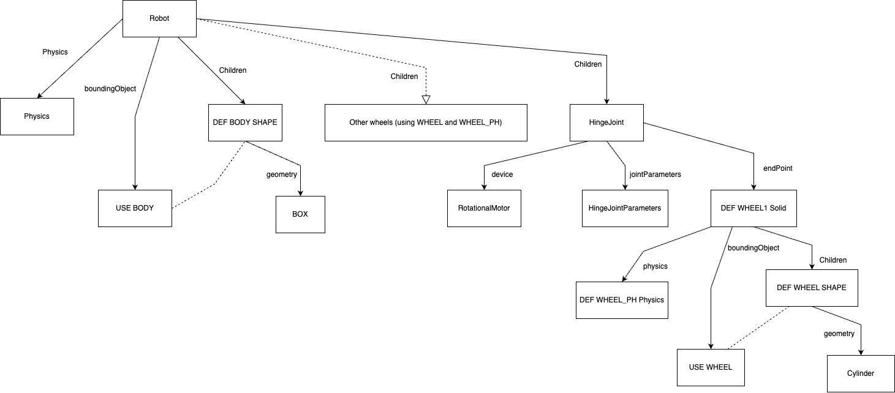

# Proyecto Final: Robótica y Sistemas Autónomos 2025-01

**Integrantes:**
* Patricio Figueroa
* Marcelo Flores
* Kavon Kermani
* Gabriel Sanzana
* Lucas Zamora

**Software de Simulación:**
* Webots R2023a

## Descripción del Proyecto

El presente proyecto tiene como objetivo el desarrollo e implementación de un robot móvil autónomo de 4 ruedas en el simulador Webots. El sistema integra control cinemático diferencial y una variedad de sensores para la percepción y navegación en un entorno con obstáculos.

El robot es capaz de:
* Detectar obstáculos en tiempo real mediante la combinación de un sensor LIDAR y sensores de distancia.
* Construir un mapa de ocupación local del entorno a partir de los datos del LIDAR.
* Planificar rutas factibles desde un punto de inicio a una meta utilizando el algoritmo de planificación **RRT (Rapidly-exploring Random Trees)**.
* Navegar de manera autónoma hacia el objetivo, replanificando la ruta dinámicamente si el camino actual se encuentra bloqueado.

El desarrollo integra percepción, planificación y control en un entorno dinámico. El robot se prueba en un entorno controlado de **8x8** con obstáculos estáticos, evaluando su desempeño en términos de eficiencia de navegación, tiempo de ejecución y robustez en la evasión de obstáculos.

## Arquitectura del Software

El sistema de control del robot se organiza en tres niveles principales:

### Percepción

* **LIDAR 2D:**
    * Obtiene un escaneo del entorno para mapear los obstáculos.
    * Los datos se utilizan para actualizar un mapa de ocupación que informa al algoritmo de planificación.
* **Sensores de Distancia:**
    * Detectan obstáculos inminentes que podrían no haber sido capturados por el LIDAR en el ciclo anterior.
    * Actúan como una capa de seguridad para la evasión reactiva inmediata.
* **GPS e IMU (Inertial Unit):**
    * Obtienen la posición (coordenadas X, Y) y la orientación (yaw) del robot en el mundo, datos cruciales para la localización y el seguimiento de la ruta.

### Planificación

* **Mapa de Ocupación:**
    * Un mapa 2D del mundo conocido por el robot, donde las celdas se marcan como libres u ocupadas por obstáculos.
* **Algoritmo de Planificación RRT (Rapidly-exploring Random Trees):**
    * Encuentra un camino factible (no necesariamente el más corto) desde la posición actual hasta el objetivo, explorando aleatoriamente el espacio libre de obstáculos.
    * Se ejecuta una vez para encontrar una ruta inicial y se vuelve a invocar (replanificación) solo si la ruta actual se encuentra bloqueada por un nuevo obstáculo detectado.

### Control

* **Control de Navegación:**
    * Sigue la secuencia de puntos (waypoints) generada por el algoritmo RRT.
    * Un controlador proporcional ajusta la velocidad de las ruedas para minimizar el error de ángulo hacia el siguiente punto del camino.
    * Si la ruta se bloquea, detiene el seguimiento y solicita una replanificación al módulo de planificación.

Esta arquitectura modular permite una navegación robusta, combinando la planificación basada en muestreo (RRT) con la percepción continua del entorno.

## Diagramas del Sistema

Aquí se presentan los diagramas que representan el sistema del robot y su interacción con el entorno.

### Diagrama de Alto Nivel

### Diagrama de Bajo Nivel (Arquitectura Interna o Flujo de Control)

## Demostración

[ **ESPACIO PARA EL VIDEO DE DEMOSTRACIÓN** - Inserta aquí el enlace o el reproductor de video de tu simulación ]

## Resultados

### Métricas de Desempeño

A continuación, se presentan los resultados de una ejecución de prueba, demostrando el desempeño del sistema en un escenario específico.

- Tiempo total de ejecución: 87.81 segundos
- Distancia total recorrida: 20.06 metros
- Distancia en línea recta (inicio a fin): 2.55 metros
- Eficiencia de la ruta (Recorrido / Línea Recta): 7.88
- Número de replanificaciones (llamadas a RRT): 7

### Análisis de Algoritmos

* **Factibilidad y Eficiencia:** El algoritmo RRT demuestra ser muy eficiente para encontrar rápidamente una solución en espacios complejos. No garantiza la ruta más corta (como se observa en la métrica de eficiencia de 7.88), pero su velocidad es clave para la replanificación en tiempo real.
* **Robustez:** La capacidad de invocar RRT nuevamente cuando la ruta se bloquea (`Número de replanificaciones: 7`) dota al robot de una gran robustez. Puede adaptarse a obstáculos no mapeados inicialmente y encontrar rutas alternativas para cumplir su objetivo. La combinación del LIDAR para el mapeo y los sensores de distancia para la seguridad inmediata permite al robot reaccionar eficazmente ante el entorno.

### Reflexión sobre Mejoras

* Implementar un control proporcional (P, PI o PID) más sofisticado para el seguimiento de la ruta, lo que permitiría trayectorias más suaves y precisas.
* Optimizar la ruta generada por RRT utilizando algoritmos de suavizado de caminos para reducir la distancia total recorrida y mejorar la eficiencia.
* Considerar el uso de algoritmos de SLAM (Simultaneous Localization and Mapping) para entornos completamente desconocidos, permitiendo al robot construir mapas más detallados y navegar en áreas más grandes.
* Explorar variantes de RRT, como RRT*, que convergen hacia una ruta óptima a medida que se añaden más muestras, balanceando la velocidad de RRT con la calidad de ruta de otros algoritmos.

